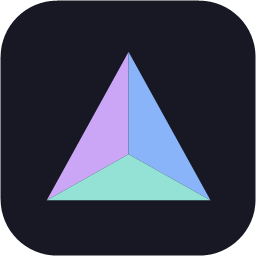
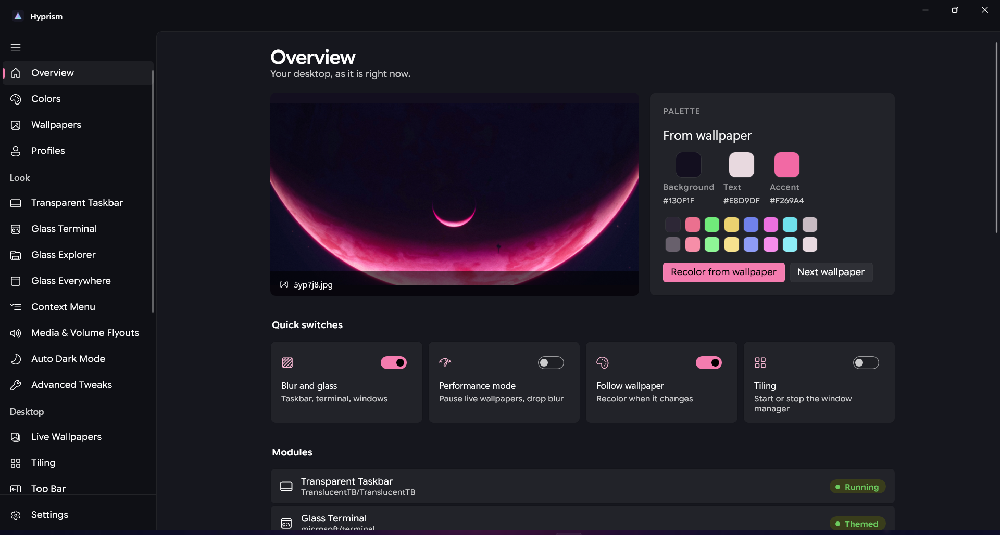
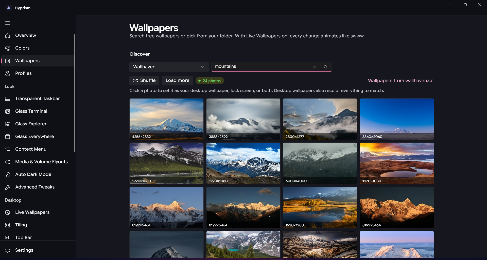
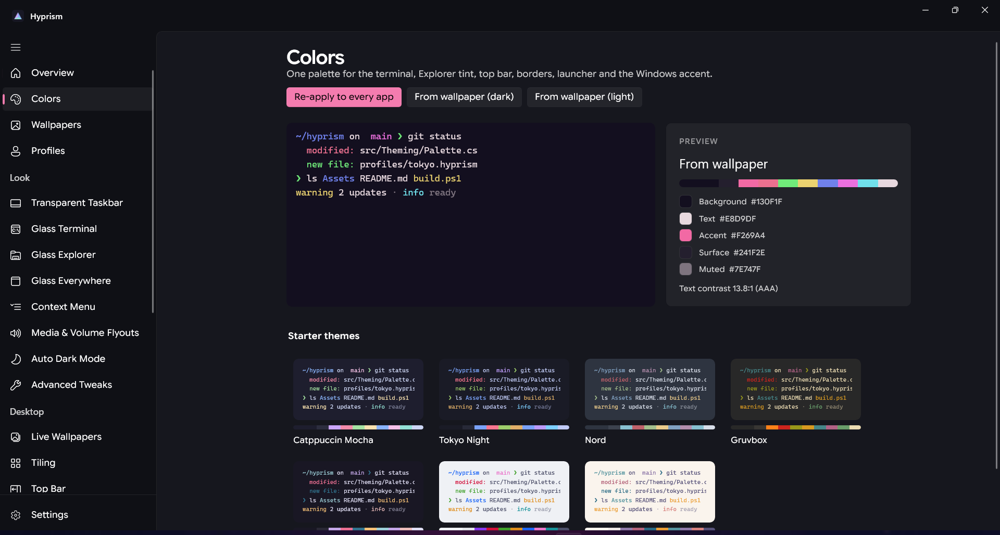
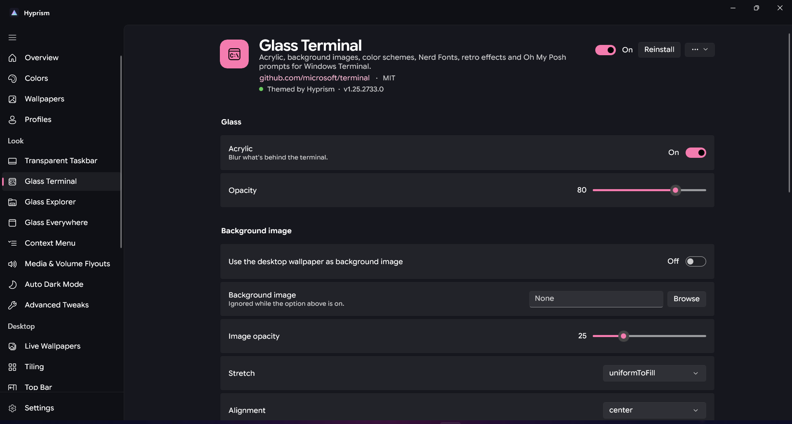
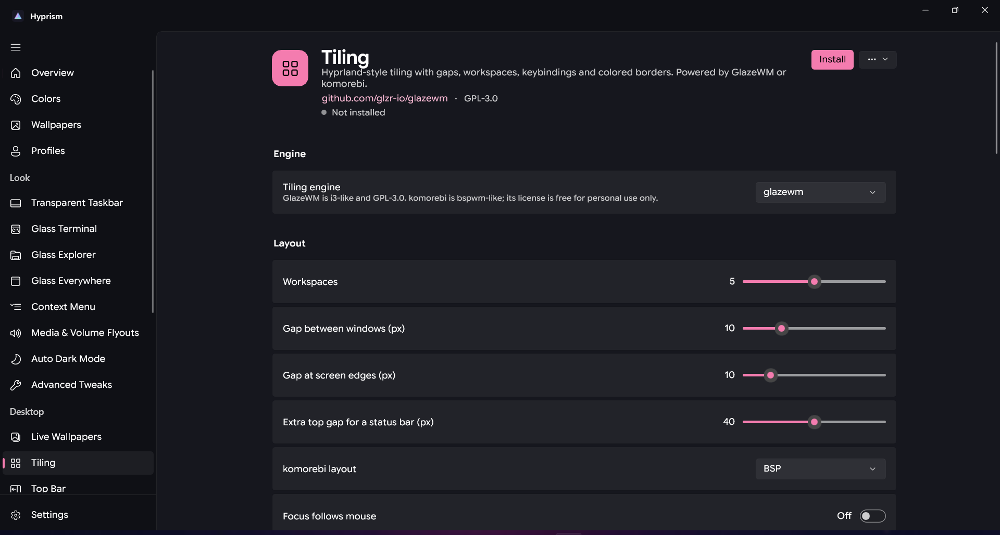
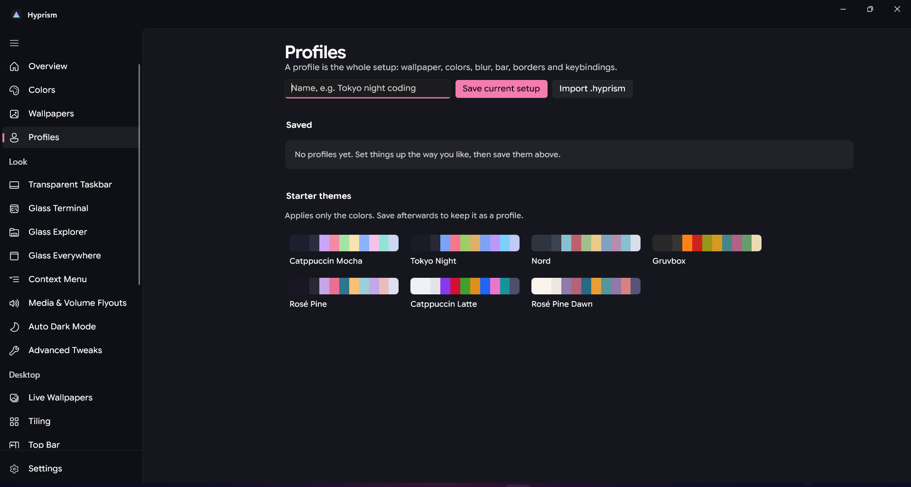
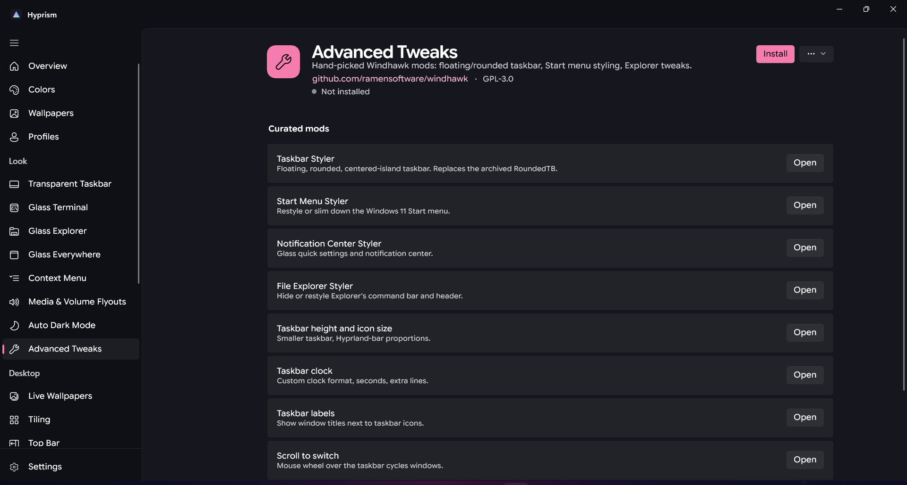
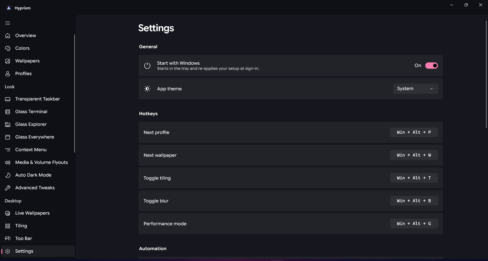

<p align="center"></p>

# Hyprism

**Hyprland vibes for Windows.**

Hyprism is a control center for ricing Windows 11 and Windows 10 22H2. It doesn't reimplement blur, tiling, bars
or launchers. It installs, configures, themes and updates mature open-source projects that already do those
well, and adds only the glue: one palette for everything, profiles, hotkeys, performance mode, safe mode and backups.


<p align="center"><b>Overview</b> · your wallpaper, its palette, quick switches and every module's status</p>

| | |
|---|---|
| <br>**Wallpapers** · search Wallhaven, Openverse, NASA and Unsplash; set as desktop, lock screen or both | <br>**Colors** · one palette for every app, from your wallpaper or a starter theme |
| <br>**Glass Terminal** · a module page: acrylic, background image, fonts, prompt themes | <br>**Tiling** · GlazeWM or komorebi with gaps, workspaces and borders |
| <br>**Profiles** · save, switch and share whole setups as `.hyprism` files | <br>**Advanced Tweaks** · curated Windhawk mods one click away |
| <br>**Settings** · start with Windows, theme, global hotkeys, updates | |

## Install

Download `Hyprism-Setup-<version>-x64.exe` from Releases and run it. It installs for your account only (no admin
needed), asks you to accept the Privacy Policy, and opens straight to Overview. Every tool is installed from its
own page when you want it.

## What it controls

| Module | Project | What Hyprism does |
|---|---|---|
| Transparent Taskbar | TranslucentTB | Clear/blur/acrylic/opaque per state (desktop, window, maximized, Start, search, Task View, battery saver), palette tint |
| Network & System Monitor | TrafficMonitor | Up/down speed, CPU, RAM, GPU, temperatures in the taskbar; font, colors, adapter, side |
| Glass Terminal | Windows Terminal + Oh My Posh + Nerd Fonts | Acrylic, opacity, background image (or your wallpaper), schemes, fonts, retro/shader effects, prompt themes with a **live preview** |
| Glass Explorer | ExplorerBlurMica | Blur/Acrylic/Mica/Clear/Mica Alt, light and dark tint, safe Explorer restart |
| Glass Everywhere | Mica For Everyone | Global backdrop, corners, title bar and per-app rules |
| Live Wallpapers | Lively Wallpaper | Video/GIF/web/shader wallpapers, pause rules, multi-monitor, plus Hyprism's swww-style transitions |
| Tiling | GlazeWM or komorebi (+ whkd, tacky-borders) | Gaps, workspaces, floating rules, borders, a visual keybinding editor that writes either engine's config |
| Top Bar | Zebar or YASB | Waybar-style bar: workspaces, clock, media, battery, network, volume, CPU; themed from the palette |
| App Launcher | Flow Launcher | Generated theme from the palette, blur, hotkey |
| Context Menu | Nilesoft Shell | Acrylic menu, palette colors, radius, font, density |
| Auto Dark Mode | Windows Auto Dark Mode | Sunset or custom schedule, and switches Hyprism profiles with Windows |
| Media & Volume Flyouts | FluentFlyout | Install and run |
| Advanced Tweaks | Windhawk | Installs from Windhawk's official offline installer; curated mods (taskbar styler, Start menu styler...) one click away |
| PowerToys | PowerToys | Toggle Command Palette, FancyZones, Color Picker, Text Extractor, Peek... |
| Text Expander | Espanso | Snippets managed from Hyprism |
| Screenshots, Volume Mixer, Monitor Brightness, Clipboard History, Quick Look, Files | ShareX, EarTrumpet, Twinkle Tray, Ditto, QuickLook, Files | Install, update, start with Windows |

Licenses and verification notes: [THIRD_PARTY_LICENSES.md](THIRD_PARTY_LICENSES.md).

## Hyprism's own features

- **Color engine** (pywal/matugen-style): k-means on a wallpaper thumbnail gives a background, text, accent and 16
  ANSI colors with guaranteed contrast. One click pushes them to the terminal, Explorer tint, taskbar, bar, borders,
  launcher, context menu and the Windows accent.
- **Profiles ("rices")**: save the whole setup (wallpaper, palette, every module's settings and on/off state),
  switch instantly, export/import as a single `.hyprism` file (a zip with `profile.json` and the wallpaper).
- **Starter themes**: Catppuccin Mocha/Latte, Tokyo Night, Nord, Gruvbox, Rosé Pine/Dawn.
- **Wallpapers**: search free wallpapers from **Wallhaven**, **Openverse** (Creative Commons) and **NASA**, or shuffle
  random **Unsplash** photos via Lorem Picsum. No account or API key; results match your screen's resolution. Any
  photo can be set as the **desktop wallpaper, lock screen, or both**. Plus a folder gallery, rotation, and
  animated transitions (grow from cursor, fade, wipe, slide) through a small Lively web wallpaper that Hyprism
  installs and drives with `Livelycu setprop`.
- **Global hotkeys** (configurable): next profile `Win+Alt+P`, next wallpaper `Win+Alt+W`, toggle tiling `Win+Alt+T`,
  toggle blur `Win+Alt+B`, performance mode `Win+Alt+G`.
- **Performance mode**: pauses live wallpapers and turns blur off; turns on by itself on battery or while a
  fullscreen game runs.
- **Safe mode**: after any change that runs inside Explorer (Explorer DLL, context menu), Hyprism watches Explorer
  for 3 minutes. If Explorer restarts on its own twice, it reverts the change and notifies you.
- **Backups**: the original Windows look (wallpaper, accent, theme, transparency) is exported before anything
  changes, and every config file is backed up the first time Hyprism writes it. *Settings > Restore original look*
  undoes everything.
- **No setup wizard**: Hyprism opens straight to Overview; install each module from its own page.
- **Live install progress**: every install shows what's happening right now (downloading, verifying, waiting for
  UAC), a progress bar, elapsed time, a Cancel button and the full log under *Details*. Status colors are green
  for done, yellow for working or a warning, red for failed.
- **Reliable installs**: only one winget task runs at a time (background status checks step aside for your
  install), and temporary errors such as "file in use" are retried automatically.
- **Antivirus-checked downloads**: tool archives (and every file inside them), update installers and wallpapers are
  scanned by your installed antivirus through AMSI before they're unpacked, run or saved, on top of SHA256 checks.
  winget installs are verified by winget's own hash check and scanned by Defender's real-time protection.
- Tray icon, close-to-tray, start with Windows, Google Sans Flex throughout, and Hyprism's own window colors for
  dark (`#0F1015` / `#16171E`) and light (`#ECE9E4` / `#F8F6F2`) modes, defined in `src/Hyprism.App/Styles.xaml`.

## Architecture

```
Hyprism.App  (WinUI 3, unpackaged, self-contained)
  Program / App ........ single instance; `--theme dark|light` from Auto Dark Mode is forwarded to the running app
  MainWindow ........... custom colors + title bar, NavigationView, tray, hotkeys, timers (auto-performance, rotation)
  Pages/* .............. Overview, Colors, Wallpapers, Profiles, Settings, and ONE generic ModulePage
  SettingsRenderer ..... turns a module's SettingDef list into SettingsCards (toggle, slider, choice, color,
                         file, multiline, keybindings, actions, live ANSI preview)
        |
        v
Hyprism.Modules  (one class per integrated project, all implement IModule)
  TranslucentTB, TrafficMonitor, WindowsTerminal, ExplorerBlurMica, Lively, MicaForEveryone, Tiling,
  StatusBar, FlowLauncher, NilesoftShell, AutoDarkMode, FluentFlyout, Windhawk, PowerToys, Espanso, ...
  Assets/slideshow ..... Lively web wallpaper for transitions;  Assets/zebar ..... Hyprism's Zebar widget
        |
        v
Hyprism.Core
  IModule / ModuleBase .. lifecycle: winget install (GitHub release + SHA256 fallback), start, autostart, stop
  Sys ................... processes, winget parsing, GitHub releases, HKCU Run, Explorer restart, elevation
  Files ................. JSONC, INI, YAML-line and "managed block" editors that preserve everything else
  Store ................. %AppData%\Hyprism\config.json (atomic writes)
  Backup / WindowsLook .. original-file and original-look backups, wallpaper, accent, transparency
  SafeMode .............. Explorer crash watch and auto-revert
  Hub ................... palette push, wallpapers (desktop / lock screen), profiles, effects, performance mode
  OnlineWallpapers ...... Wallhaven, Openverse, NASA and Lorem Picsum search and download
  Antivirus ............. AMSI scan of every download before it's used
  Updater / Cleanup ..... self-update from GitHub Releases; `--uninstall` cleanup
        |
        v
Hyprism.Theming
  Palette / Rgb ......... colors, HSL, WCAG contrast
  PaletteExtractor ...... k-means color engine
  StarterThemes ......... built-in palettes
  Generators ............ Windows Terminal scheme, CSS variables, Flow Launcher theme
```

Every module write goes through `ModuleBase.Write`, which backs the file up first and skips identical content (so
Explorer only restarts when its config actually changed).

### The `IModule` interface

```csharp
public interface IModule
{
    string Id { get; }
    string Name { get; }
    string Description { get; }
    string Glyph { get; }                 // Segoe Fluent Icons
    ModuleCategory Category { get; }      // Look, Desktop, Productivity
    string Repo { get; }                  // "owner/repo"
    string License { get; }
    IReadOnlyList<SettingDef> Settings { get; }   // rendered generically by the app
    bool RunsInBackground => true;        // false for Terminal/Files: "on" = keep themed, not autostart

    Task<ModuleStatus> GetStatusAsync(CancellationToken ct = default);   // installed, running, version, update
    Task InstallAsync(IProgress<string>? log = null, CancellationToken ct = default);   // also updates
    Task UninstallAsync(IProgress<string>? log = null, CancellationToken ct = default);
    Task EnableAsync(CancellationToken ct = default);    // start now + at sign-in
    Task DisableAsync(CancellationToken ct = default);   // stop + remove from sign-in
    Task ApplyAsync(JsonObject settings, CancellationToken ct = default);   // write the app's config
    Task RestoreDefaultsAsync(CancellationToken ct = default);              // put original files back
    Task ApplyPaletteAsync(Palette palette, CancellationToken ct = default) => Task.CompletedTask;
    Task SetEffectsAsync(bool blur, bool animate, CancellationToken ct = default) => Task.CompletedTask;
    Task InvokeAsync(string key, CancellationToken ct = default) => Task.CompletedTask;   // action buttons
}
```

Adding a project is one class: subclass `ModuleBase`, set `WingetId`/`ProcessName`/`ExePath`, declare
`Settings`, implement `ApplyAsync`, and add it to `Catalog.All`. The UI needs no changes.

## Build

**Visual Studio 2022 (17.12+)**, workloads:
- **.NET desktop development**
- **Windows application development** (WinUI / Windows App SDK C# templates)

Open `Hyprism.sln`, set `Hyprism.App` as the startup project, choose `x64`, press F5.

**Command line** (.NET 8 SDK; Windows 10 SDK 22621 comes in through NuGet):

```bash
dotnet build src/Hyprism.App -p:Platform=x64
```

```bash
dotnet run --project tests/Hyprism.Checks
```

**Release and installer** (self-contained publish, then Inno Setup 6 if it's installed):

```powershell
.\build.ps1 -Arch x64
```

`build.ps1` cleans old outputs, runs the self-checks, and produces one file: `dist/Hyprism-Setup-<version>-x64.exe`.
It's a per-user installer (no admin needed) that installs to `%LocalAppData%\Programs\Hyprism` and shows up in
**Settings > Apps > Installed apps**. Its first page is Hyprism's **Privacy Policy and license**, which must be
accepted to install (`installer/PrivacyPolicy.txt`, also copied into the install folder).

**Installing over an older version** upgrades in place: setup closes Hyprism, replaces its files, keeps your settings
and profiles, and starts it again.

**Uninstalling** (Settings > Apps, or `unins000.exe`) first runs `Hyprism.exe --uninstall`, which:
- removes Hyprism's sign-in entries,
- unregisters the Glass Explorer extension (one UAC prompt) and restarts Explorer to unload it,
- deletes downloaded tools and caches.

It then asks whether to restore your original Windows look (`--restore`) and whether to delete your settings
(`--purge`). Apps Hyprism installed through winget stay installed. Test it safely with `unins000.exe /DRYRUN=1`,
which only writes what it would do to `%TEMP%\hyprism-uninstall.log`.

**Updates**: in *Settings > Updates*, set the GitHub `owner/repo` that publishes releases. Hyprism checks once a day,
downloads `Hyprism-Setup-*-x64.exe`, verifies GitHub's SHA256 digest (it refuses to install an unverified file),
scans it with your antivirus and runs it silently; the setup upgrades in place and relaunches Hyprism.

## Where things live

| What | Where |
|---|---|
| Hyprism settings | `%AppData%\Hyprism\config.json` |
| Profiles | `%AppData%\Hyprism\profiles\*.json` |
| Backups | `%AppData%\Hyprism\backups\` (`original\` never overwritten, `last\` for safe-mode undo, `windows-look\`) |
| Tools from GitHub releases | `%LocalAppData%\Hyprism\tools\` |
| Downloaded wallpapers (with credit files) | `%AppData%\Hyprism\wallpapers\` |
| Installed-apps cache | `%LocalAppData%\Hyprism\winget-inventory.json` |

## License

MIT for Hyprism's own code. Each integrated project keeps its own license and runs as its own process; see
[THIRD_PARTY_LICENSES.md](THIRD_PARTY_LICENSES.md). Google Sans Flex is under the SIL Open Font License 1.1.
